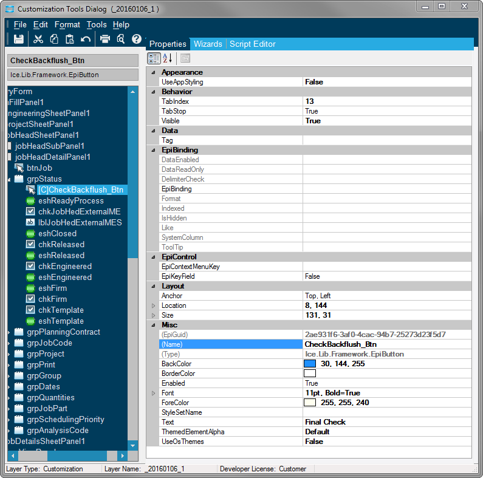

# FinalCheckJobEntry
In Job Entry when a Job is engineered a final check is completed before it goes down to the shop. This final check is used to ensure everything goes smoothly once the job returns from the shop and is being completed and closed. The checks that are completed are:

- Every material is set to backflush or is set to buy direct on a P.O.
- A final operation has been specified on the job, and has not run into the resequencing error.
- None of the material parts are inactive in Epicor.
- Checks for resequence issues
- Checks for Obsolete Operations. Any Operation Description starting with (OB is considered obsolete

#### Navigate to this program from the Main Menu:

_Production Management > Job Management > General Operations > **Job Entry**_ 

Make sure you have developer mode turned on.

#### Steps to Customize Final Check within Job Entry

1. Setup a button to run the Final Check custom code.
2. Create the button trigger that runs when the button is pressed.
3. Create a trigger that runs when the job is set to release.
4. Add Adapters so the custom code can reference the Part database.

In this case we are setting up two triggers, one when the button is pressed and another when the job is finally released. You don't necessary need both triggers but having both can be useful. The user can use the button to run the final check but if they forget to run it the event will run automatically when the job is released.

1. Once you have opened the Customization screen, click the Tools dropdown and select Toolbox.

1. Select EpiButton from the Toolbox.
2. Drag out the button to the size you need.

- you can modify the look of the button by changing it's properties.

#### Step 2 - Create Button Click Event

1. From the Customization Window navigate to the Event Wizard Tab.
2. Set the Control Type Filter to EpiButton.
3. For the Custom Control select your custom button you created.
4. For the Available Control Events select Click.
5. Now Add this event by clicking the right arrow.
6. After click the Update All Event Code button to automatically add the custom code to the Script Editor.

#### Step 3 - Create a Job Release Event

1. From the Customization Window navigate to the Form Event Wizard Tab.
2. Set the Event Type Filter to AfterFieldChange.
3. Set the Table to JobHead.
4. Set the Field to JobReleased.
5. Now Add this event by clicking the right arrow.
6. After click the Update All Event Code button to automatically add the custom code to the Script Editor.

#### Step 4 - Add the Part Adapter

1. Under Tools open Assembly Reference Manager

1. Click add Custom Reference.
2. You will be searching for the Part Adapter.

1. Change the filter to all files.
2. Find the Part Adapter.
3. Click Open to select that adapter.

Once you add the two events using the Customization Wizards the Script Editor will have some new code that has been added automatically. We need to add some custom code to run when the events are triggered.

See the custom code [here](FinalCheckJobEntry.h)
